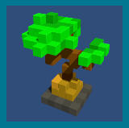

# Overview: Beamable Sample Project

This sample project demonstrates specific [Beamable](https://beamable.com/) features and services.

**Project Configuration**
* `Unity Target` - Standalone MAC/PC
* `Unity Version` - 2019.4.14f1 or above

**Project Structure**
* `README.md` - This README file
* `client/` - Open this folder in the Unity Editor
* `client/Assets/` - Core files of the project
* `client/Assets/Scenes/` - **Open a scene** in the Unity Editor to play the game!
* `client/Assets/3rdParty/` - Dependency asset files for the project
* `client/Packages/` - Dependency package files for the project

**Beamable SDK**
* **Included**: This project includes the Beamable SDK for Unity
* **Version**: The latest public release as of each GIT commit

# Details: Microservices ABC Sample Project

### What is A Beamable Clicker?
Button clicks grow trees. Click as many times as possible within 
the time limit. This sample project allows game makers to 
understand and apply the benefits of the Leaderboard Flow in 
game development.
 [Leaderboard - Sample Project](https://docs.beamable.com/docs/leaderboard-flow-sample)

### What is Beamable?
Beamable is the low-code option for rapidly adding social, 
commerce, and content management features to your live game. 
Learn how to do that with Beamable's online product documentation.
 [docs.beamable.com](https://docs.beamable.com/)

### What is the Leaderboard Flow?
The purpose of this feature is to allow the player to see the 
Leaderboard UI which shows a list of highscores by all players of a game.
 [Leaderboard Flow](https://docs.beamable.com/docs/leaderboard-flow)

### Got feedback?
Let us know what you think or ask any questions you might have.
 [Contact Us](https://docs.beamable.com/discuss)
